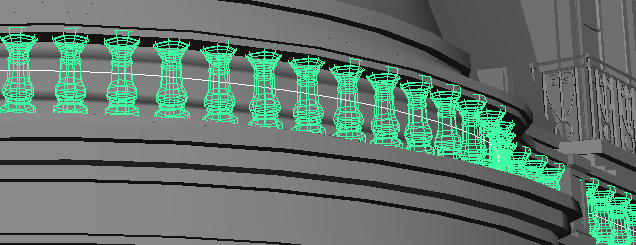
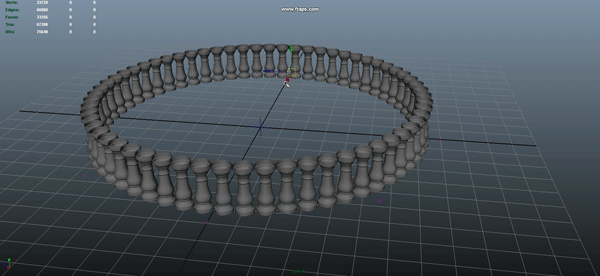

Instance Along Curve
==================

### About
Maya Plugin for interactive instancing of shapes along curves.

### Features

### Installation

Save instanceAlongCurve.py under MAYA_PLUG_IN_PATH, which in Windows usually is C:\Users\<username>\Documents\maya\<version>\plug-ins

### Use
To use the plugin, select a curve and the shape you want to instance and go to Edit->Instance Along Curve. You can save it as a Shelf Button if you want.

### Documentation

In progress.
